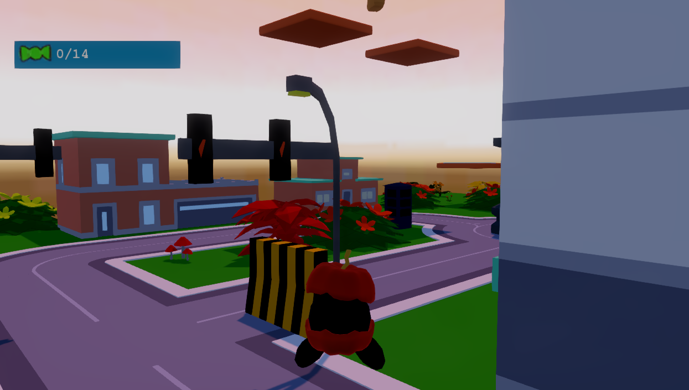

# F# Game Jam Entry

Entry for [F# Game Jam](https://itch.io/jam/fsharp-jam-oct21)

Created using the [Stride Engine](https://www.stride3d.net) with a custom MVU architecture so that the majority of the logic can be done through F#

<figure class="video_container">
  <video controls="true" allowfullscreen="true" style="width: 100%;">
    <source src="{{ site.url }}/Vid.webm?raw=true" type="video/webm">
  </video>
</figure>

[Preview](https://user-images.githubusercontent.com/1715430/188252466-419b12e3-60a4-4b0d-80dc-2e981f6b9d5a.webm)
